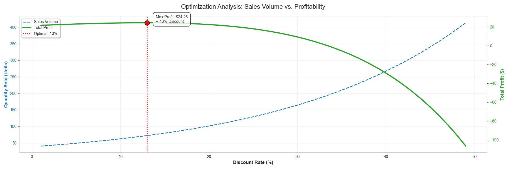
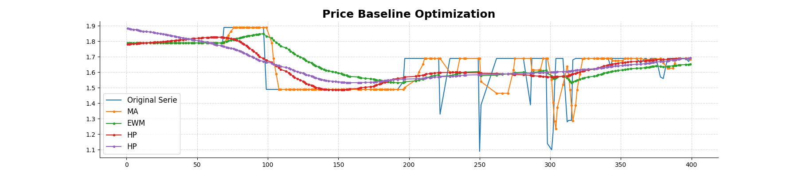
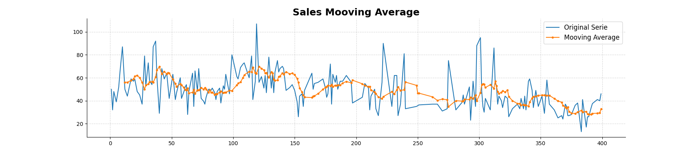

# Price Elasticity Modeling & Discount Optimization Strategy
<p align="center">
  
</p>

## Executive Summary
This project aims to optimize retail pricing strategies by modeling the Price Elasticity of Demand (PED). By analyzing historical sales data, the system quantifies customer sensitivity to price changes and determines the optimal discount depth required to maximize revenue and profit margins.

The core objective is to transition from rule-based pricing to data-driven dynamic pricing, leveraging statistical regression techniques and Machine Learning algorithms to predict sales volume at various price points.
  
<p align="center">
  
</p>
## Project Scope & Objectives

### 1. Economic Modeling
* **Price Elasticity of Demand (PED):** Calculation of elasticity coefficients to categorize products (Elastic vs. Inelastic).
* **Demand Curve Estimation:** Constructing mathematical functions ($Q = f(P)$) to simulate market behavior under different pricing scenarios.

<p align="center">
  
</p>


### 2. Machine Learning Implementation
* **Feature Engineering:** Processing temporal features (seasonality), categorical attributes, and promotional history.
* **Demand Forecasting:** Utilizing regression models (e.g., Linear Regression, Random Forest, Gradient Boosting) to predict unit sales based on discount levels.

### 3. Strategy Optimization
* **Revenue Maximization:** Identifying the specific price point where the marginal revenue equals zero (or maximizes the total revenue area under the curve).
* **Scenario Analysis:** Simulating the financial impact of 10%, 20%, and 30% discount strategies versus baseline pricing.

## Repository Structure

The project follows a modular Data Science architecture to ensure reproducibility and scalability.

```text
FinalProjectV3/
├── config/              # Global configuration parameters (paths, constants)
├── data/                # Data storage (git-ignored)
│   ├── raw/             # Original immutable datasets
│   └── processed/       # Transformed datasets ready for modeling
├── notebooks/           # Jupyter Notebooks for EDA and prototype modeling
├── src/                 # Source code for production pipelines
│   ├── data_loader.py   # Data ingestion and validation scripts
│   ├── preprocessing.py # Cleaning, normalization, and feature encoding
│   ├── elasticity.py    # Log-log modeling and elasticity calculations
│   └── models.py        # ML training and inference logic
├── requirements.txt     # Python dependencies
└── README.md            # Project documentation
